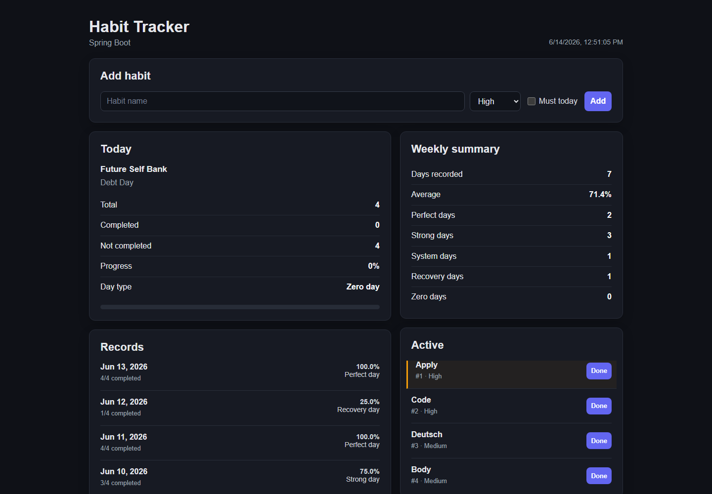
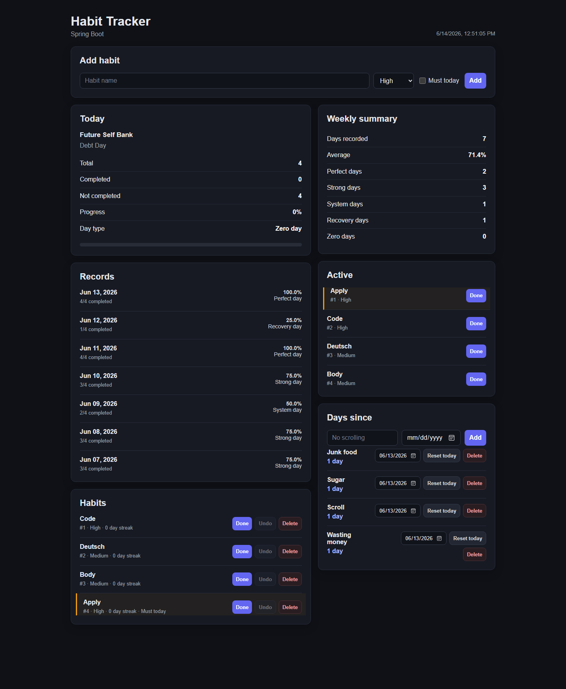

# Habit Tracker

Full-stack habit tracking application built with Spring Boot, PostgreSQL, and vanilla JavaScript.

The application tracks daily habit completion, streaks, weekly statistics, historical day records, and counters for time since a selected event.

## Screenshots



<details>
<summary>Full desktop view</summary>



</details>

## Features

- Create, complete, undo, update, and delete habits
- Assign habit priority and mark habits as required today
- Calculate daily completion progress and day type
- Track completion streaks for individual habits
- Store daily statistics and display seven-day summaries
- Browse historical records by day
- Track days since an event and reset its start date
- Automatically reset daily habit completion
- Responsive dark web interface

## Tech Stack

- Java 21
- Spring Boot 4
- Spring Web MVC
- Spring JDBC
- PostgreSQL
- Maven
- JUnit 5 and Mockito
- HTML, CSS, and vanilla JavaScript

## Running Locally

### Requirements

- Java 21
- PostgreSQL

### Database

Create the database:

```sql
CREATE DATABASE habit_tracker;
```

The default connection is configured in `src/main/resources/application.properties`:

```properties
spring.datasource.url=jdbc:postgresql://localhost:5432/habit_tracker
spring.datasource.username=postgres
spring.datasource.password=postgres
```

Tables are created automatically from `schema.sql`.

### Start

Windows:

```powershell
.\mvnw.cmd spring-boot:run
```

Linux or macOS:

```bash
./mvnw spring-boot:run
```

Open [http://localhost:8081](http://localhost:8081).

## API

### Habits

| Method | Endpoint | Description |
|---|---|---|
| `GET` | `/habits` | List habits |
| `POST` | `/habits` | Create a habit |
| `GET` | `/habits/{id}` | Get a habit |
| `PUT` | `/habits/{id}` | Update a habit |
| `PATCH` | `/habits/{id}/complete` | Mark as completed |
| `PATCH` | `/habits/{id}/uncomplete` | Undo completion |
| `DELETE` | `/habits/{id}` | Delete a habit |
| `GET` | `/habits/{id}/streak` | Get the current streak |
| `GET` | `/habits/not-completed` | List active habits |
| `GET` | `/habits/required` | List habits required today |
| `GET` | `/habits/priority/{priority}` | Filter by priority |
| `GET` | `/habits/search?name={name}` | Find by name |
| `GET` | `/habits/next` | Get the next habit |

### Statistics

| Method | Endpoint | Description |
|---|---|---|
| `GET` | `/habits/stats` | Get today's statistics |
| `GET` | `/stats/history` | Get daily records |
| `PATCH` | `/stats/history/{date}` | Update a daily record |
| `GET` | `/stats/summary?days=7` | Get a period summary |
| `GET` | `/stats/today/message` | Get today's progress message |
| `GET` | `/system/day-status` | Get the current day status |
| `GET` | `/system/time` | Get server time |

### Days Since

| Method | Endpoint | Description |
|---|---|---|
| `GET` | `/days-since` | List counters |
| `POST` | `/days-since` | Create a counter |
| `PATCH` | `/days-since/{id}/start-date` | Change the start date |
| `DELETE` | `/days-since/{id}` | Delete a counter |

## Tests

```powershell
.\mvnw.cmd test
```

The test suite covers application startup and habit service behavior.

## Project Structure

```text
src/main/java/.../
├── controller endpoints
├── dto request and response models
├── model domain objects
├── repository JDBC data access
├── service business logic
├── scheduler daily reset
└── startup reset check

src/main/resources/
├── static/       web interface
├── schema.sql    database schema
└── application.properties
```
