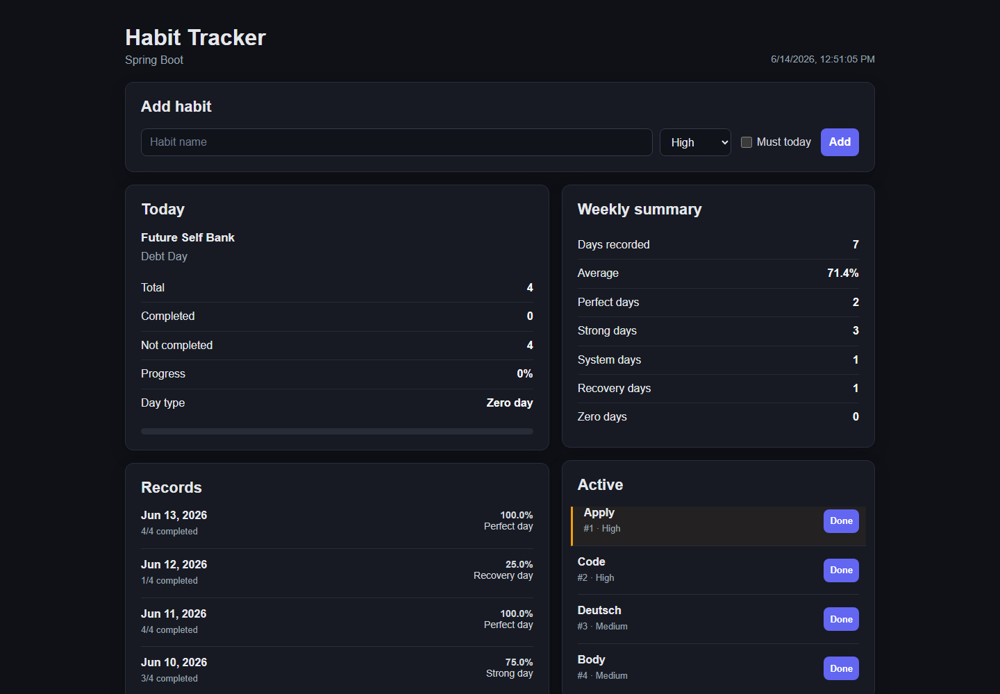
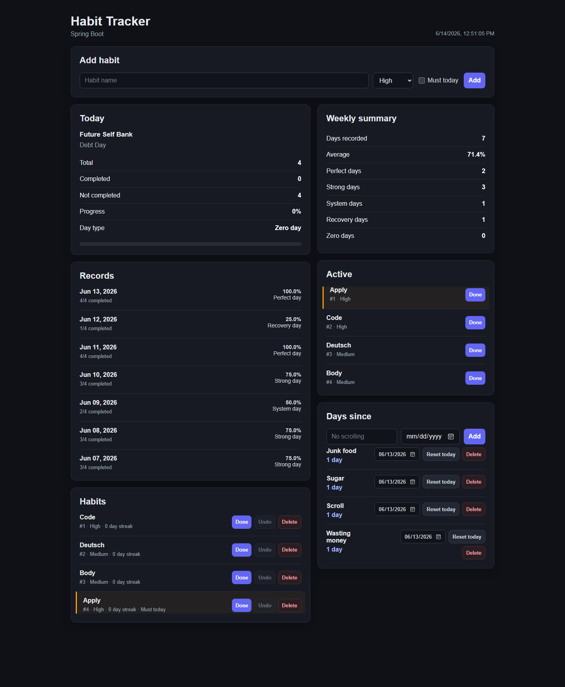

# Habit Tracker

[](https://github.com/MiroCoder/habit-tracker-api/actions/workflows/ci.yml)

Full-stack habit tracking application built with **Java 21, Spring Boot 4, PostgreSQL and vanilla JavaScript**.

The application tracks daily habit completion, streaks, weekly statistics, historical records, days-since counters and rotating daily phrases.

## Preview



<details>
<summary>Full desktop view</summary>



</details>

## Highlights

- REST API with validation and layered backend architecture
- PostgreSQL persistence through Spring JDBC
- DTO-based request/response flows
- Daily statistics, streaks and historical summaries
- Scheduled daily reset behavior
- Daily phrase management with search, activation and duplicate protection
- JUnit 5 / Mockito tests with isolated H2 test database
- Docker + Docker Compose local stack
- GitHub Actions CI on Java 21
- OpenAPI / Swagger UI

## Tech Stack

**Backend:** Java 21, Spring Boot 4, Spring Web MVC, Spring JDBC, Jakarta Validation  
**Database:** PostgreSQL, H2 for tests  
**Testing:** JUnit 5, Mockito  
**Build / DevOps:** Maven Wrapper, Docker, Docker Compose, GitHub Actions  
**API Docs:** OpenAPI 3, Swagger UI  
**Frontend:** HTML, CSS, vanilla JavaScript

## Quick Start with Docker

```bash
git clone https://github.com/MiroCoder/habit-tracker-api.git
cd habit-tracker-api
docker compose up --build
```

Application:

```text
http://localhost:8081
```

Swagger UI:

```text
http://localhost:8081/swagger-ui.html
```

OpenAPI JSON:

```text
http://localhost:8081/v3/api-docs
```

## Run without Docker

Requirements:

- Java 21
- PostgreSQL

Create the database:

```sql
CREATE DATABASE habit_tracker;
```

The app reads database configuration from:

```text
DB_URL
DB_USERNAME
DB_PASSWORD
```

and falls back to local PostgreSQL defaults for development.

Windows:

```powershell
.\mvnw.cmd spring-boot:run
```

Linux/macOS:

```bash
./mvnw spring-boot:run
```

## Main API

### Habits

| Method | Endpoint | Description |
|---|---|---|
| `GET` | `/habits` | List habits |
| `POST` | `/habits` | Create habit |
| `GET` | `/habits/{id}` | Get habit |
| `PUT` | `/habits/{id}` | Update habit |
| `PATCH` | `/habits/{id}/complete` | Complete habit |
| `PATCH` | `/habits/{id}/uncomplete` | Undo completion |
| `DELETE` | `/habits/{id}` | Delete habit |
| `GET` | `/habits/{id}/streak` | Current streak |
| `GET` | `/habits/not-completed` | Active habits |
| `GET` | `/habits/required` | Required today |
| `GET` | `/habits/priority/{priority}` | Filter by priority |
| `GET` | `/habits/search?name={name}` | Search by name |
| `GET` | `/habits/next` | Next habit |

### Statistics

| Method | Endpoint | Description |
|---|---|---|
| `GET` | `/habits/stats` | Today's statistics |
| `GET` | `/stats/history` | Daily history |
| `PATCH` | `/stats/history/{date}` | Update historical record |
| `GET` | `/stats/summary?days=7` | Period summary |
| `GET` | `/stats/today/message` | Progress message |
| `GET` | `/system/day-status` | Day status |
| `GET` | `/system/time` | Server time |

### Days Since

| Method | Endpoint | Description |
|---|---|---|
| `GET` | `/days-since` | List counters |
| `POST` | `/days-since` | Create counter |
| `PATCH` | `/days-since/{id}/start-date` | Change start date |
| `DELETE` | `/days-since/{id}` | Delete counter |

### Daily Phrases

| Method | Endpoint | Description |
|---|---|---|
| `GET` | `/daily-phrases` | List phrases |
| `POST` | `/daily-phrases` | Create phrase |
| `GET` | `/daily-phrases/today` | Today's phrase |
| `GET` | `/daily-phrases/{id}` | Get phrase |
| `PUT` | `/daily-phrases/{id}` | Update phrase |
| `PATCH` | `/daily-phrases/{id}/active` | Toggle active state |
| `DELETE` | `/daily-phrases/{id}` | Delete phrase |
| `GET` | `/daily-phrases/search?author={author}` | Search by author |
| `GET` | `/daily-phrases/authors` | List authors |
| `GET` | `/daily-phrases/count` | Count phrases |

## Tests

```powershell
.\mvnw.cmd test
```

Tests cover application startup, habit service behavior and daily phrase logic. They use an isolated H2 database and do not modify the local PostgreSQL database.

## Architecture

```text
Controller → Service → Repository → PostgreSQL
             ↓
           DTOs
```

```text
src/main/java/com/mirocoder/habittracker/
├── dto/
├── exception/
├── model/
├── repository/
├── scheduler/
├── service/
└── startup/
```

## Author

[Miroslav Nekhaev / MiroCoder](https://github.com/MiroCoder)
